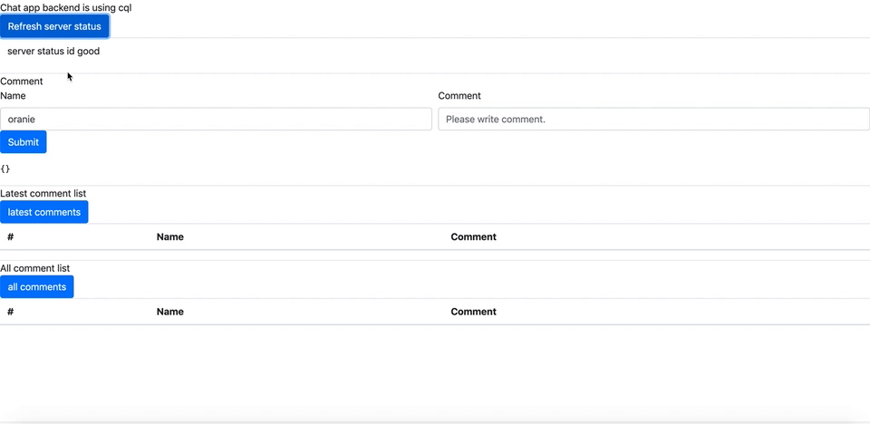

## This project is training and demo app using Cassandra.


Realtime Comment Demo App




## High level architecture


## Envroiment

golang 1.13

Docker version 19.03.5, build 633a0ea

## Cassandra setting

## Create ECR repository

## Build
```shell script
GOOS=linux GOARCH=amd64 CGO_ENABLED=0  go build ./main.go
docker build -t $IMAGE_REPO_NAME .
docker tag $IMAGE_REPO_NAME:$IMAGE_TAG $AWS_ACCOUNT_ID.dkr.ecr.$AWS_DEFAULT_REGION.amazonaws.com/$IMAGE_REPO_NAME:$IMAGE_TAG
docker push $AWS_ACCOUNT_ID.dkr.ecr.$AWS_DEFAULT_REGION.amazonaws.com/$IMAGE_REPO_NAME:$IMAGE_TAG
```

## Deploy

## Setting

|EnvroimentName|Description|Default value|
|---|---|---|
|CASSANDRA_ENDPOINT |Cassandra cluster endpoint(ip or domain)|127.0.0.1|
|CASSANDRA_USER|Cassandra cluster user|cassandra|
|CASSANDRA_PASS|Cassandra cluster user pass|cassandra|
|CASSANDRA_PORT|Cassandra cluster network port|9042|
|CASSANDRA_KS|Cassandra cluster key spacename|example|
|APP_ENDPOINT|Chat App use Endpoint|http://127.0.0.1|
|APP_PORT |Chat App use network port|8080|
|APP_ENV|App run envroiment|test|

### local app start

# Production Deploy
## 1st step : create service IAM credentials


## 2nd step : 

## 3rd step : 

## 4th step : 


## golang Test


## Data Modeling
Data Modeling:

|name(PK)  |time(clustering column)  |comment  |chat_room |
|---|---|---|---|
|text  |text(micro sec unixtime)  |text  |text |

|chat_room(PK)  |time(clustering column)  |comment  |name |
|---|---|---|---|
|text  |text(micro sec unixtime)  |text  |text |

## API

* /chat

return chat client HTML and js.
    
* /chat/comments/add

client sent post request with name,comment txt, get response add comment status

POST value {"name": "oranie", "comment":"hello world"}


* /chat/comments/all

client sent get request, get all comment.
    
* /chat/comments/latest

client sent get request latest 20 comments.

* /chat/comments/latest/{latest_seq_id}

client sent get request with latest chat id, get the difference comments.
    

# License
This library is licensed under the MIT-0 License. See the LICENSE file.