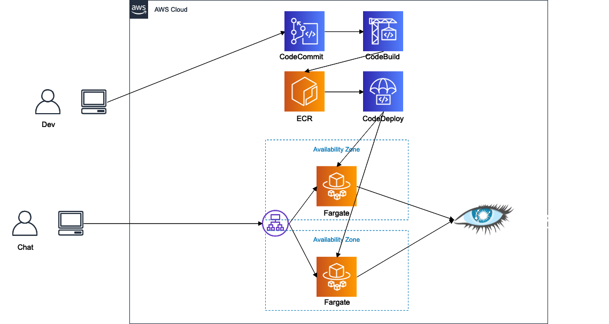

## This project is training and demo app using Cassandra.


Realtime Comment Demo App


## High level architecture


## Envroiment

golang 1.13

Docker version 19.03.5, build 633a0ea

## Environment Setting
If you need to run app on CI/CD,test and prpduction environment.Please overwrite these value.

|EnvironmentName|Description|Default value|
|---|---|---|
|CASSANDRA_ENDPOINT |Cassandra cluster endpoint(ip or domain)|127.0.0.1|
|CASSANDRA_USER|Cassandra cluster user|cassandra|
|CASSANDRA_PASS|Cassandra cluster user pass|cassandra|
|CASSANDRA_PORT|Cassandra cluster network port|9042|
|CASSANDRA_KS|Cassandra cluster key spacename|example|
|APP_ENDPOINT|Chat App use Endpoint|http://127.0.0.1|
|APP_PORT |Chat App use network port|8080|
|APP_ENV|App run envroiment|test|
|Build setting|||
|IMAGE_REPO_NAME|Docker container repogitory name.||
|IMAGE_TAG|Docker container tag||
|AWS_DEFAULT_REGION|Docker container repogitory region||
|AWS_ACCOUNT_ID|for Docker container repogitory ||

## Local app start
```shell script
go run ./main.go
```

note: If you need to connect remote cassandra cluster, It might be a good idea to use an SSH tunnel.
```shell script
ssh ${SSH_TUNNEL_HOST} -L 9042:${CASSANDRA.ENDPOINT}:9042
```


## Build and Deploy
This project build docker container.Any environment where containers and Cassandra can run is OK.
Example using ECR, ECS Fargate, Amazon MCS.

## Cassandra setting(Amazon MCS)

https://docs.aws.amazon.com/mcs/latest/devguide/accessing.html

https://docs.aws.amazon.com/mcs/latest/devguide/getting-started.html

Create Cassandra connect user
```
aws iam create-service-specific-credential --user-name USERNAME --service-name cassandra.amazonaws.com
```

cqlsh ssl setting
```shell script
curl https://www.amazontrust.com/repository/AmazonRootCA1.pem -O

cat $HOME/.cassandra/cqlshrc

[connection]
port = 9142
factory = cqlshlib.ssl.ssl_transport_factory

[ssl]
validate = true
certfile =  $HOME/AmazonRootCA1.pem
````

```
connect Amazon MCS
cqlsh {endpoint} {port} -u {ServiceUserName} -p {ServicePassword} --ssl

Create KeySpace(This app auto create table.)

CREATE KEYSPACE IF NOT EXISTS example WITH REPLICATION={'class': 'SingleRegionStrategy'};
```

If you want run Cassandra node on EC2, This project ./cassandra_conf_sample/cassandra.yaml may be helpful, 
Using Docker containers is also effective

https://hub.docker.com/_/cassandra

## Create ECR repository
https://docs.aws.amazon.com/ja_jp/AmazonECR/latest/userguide/ECR_AWSCLI.html

## Build and push container image(example Amazon ECR)
```shell script
GOOS=linux GOARCH=amd64 CGO_ENABLED=0  go build ./main.go
docker build -t $IMAGE_REPO_NAME .
docker tag $IMAGE_REPO_NAME:$IMAGE_TAG $AWS_ACCOUNT_ID.dkr.ecr.$AWS_DEFAULT_REGION.amazonaws.com/$IMAGE_REPO_NAME:$IMAGE_TAG
docker push $AWS_ACCOUNT_ID.dkr.ecr.$AWS_DEFAULT_REGION.amazonaws.com/$IMAGE_REPO_NAME:$IMAGE_TAG
```

This operation is written in buildspec.yaml for codebuild.

## CodeBuild
https://docs.aws.amazon.com/ja_jp/codebuild/latest/userguide/sample-docker.html

## Create ECS Fargate Cluster
https://docs.aws.amazon.com/ja_jp/AmazonECS/latest/developerguide/ECS_GetStarted_Fargate.html

### Create ECS task difinition

### Create ECS Service

If you run 1 container task, not need ALB or NLB.

## Data Modeling
Data Modeling:

Pattern 1

|name(PK)  |time(clustering column)  |comment  |chat_room |
|---|---|---|---|
|text  |text(micro sec unixtime)  |text  |text |

Pattern 2

|chat_room(PK)  |time(clustering column)  |comment  |name |
|---|---|---|---|
|text  |text(micro sec unixtime)  |text  |text |

## API List

* /

Return server status.

* /run-test

return  test data insert and select result.

* /chat

return chat client HTML and js.
    
* /chat/comments/add

client sent post request with name,comment txt, get response add comment status

POST value {"name": "oranie", "comment":"hello world"}


* /chat/comments/all

client sent get request, get all comment.
    
* /chat/comments/latest

client sent get request latest 20 comments.

* /chat/comments/latest/{latest_seq_id}

client sent get request with latest chat id, get the difference comments.
    

# License
This library is licensed under the MIT-0 License. See the LICENSE file.
